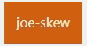

# 

1、有关大框子css3动画：js点击结合css动画（/animate+big）；包括弹进来弹出去，淡入淡出；translate/rotate/scale

首先scale/opacity 结合

transform-origin: x y 结合 rotateX/Y    => 变成前滚翻翻转/侧向翻转；

transform-origin: x y 结合 translateX/Y => 变成上下弹动；

2、有关小框子css3动画：包括晃动旋转变形跳舞；（/animate+small）；translate/rotate/scale/skew/background/border

transform-origin: x y  结合 scaleX/Y 1、结合 :before position:absolute:left/top/right/bottom => 变成背景从上下左右四面八方过来/从中间推出来；

                                     2、结合 border                                         => 变成边框从上下左右四面八方过来/从中间推出来；

transform-origin: x y  结合 skewX/Y   => 变成从头晃动/从腰晃动；

transform-origin: x y  结合 rotate 结合 translateX  => 变成各种各样晃动；

3、渲染动画：background-blend-mode/mixblend-mode/filter；（/css-rendering）

4、变形动画:clip-path/border/:before/border-radius/box-shadow(/css-shape)

腻害的同学们（有遗漏）：

https://github.com/fangxianzheng/anictr-Animate.css

https://github.com/luuman/CSS3

https://github.com/zhouzuguang/animate/tree/master/css
