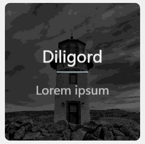
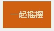

# 

1、有关大框子css3动画：js点击结合css动画（/animate+big）

包括弹进来弹出去，淡入淡出；

translate/rotate/scale

2、有关小框子css3动画：包括晃动旋转变形跳舞；（/animate+small）

translate/rotate/scale/skew/background/border

3、渲染动画：background-blend-mode/mixblend-mode/filter；（/css-rendering）

4、变形动画:clip-path/border/:before/border-radius/box-shadow(/css-shape)

腻害的同学们（有遗漏）：

https://github.com/fangxianzheng/anictr-Animate.css

https://github.com/luuman/CSS3

https://github.com/zhouzuguang/animate/tree/master/css
